# LightNote AI — AI-Powered Video Object Editor

> **Edit objects in videos using natural-language instructions.**
>
> Upload a video, optionally provide a reference image, describe the edit, and let the AI video pipeline handle the rest.

## Application Preview

<table>
<tr>
<td align="center"><strong>Application</strong></td>
<td align="center"><strong>Processing</strong></td>
<td align="center"><strong>Result</strong></td>
</tr>
<tr>
<td>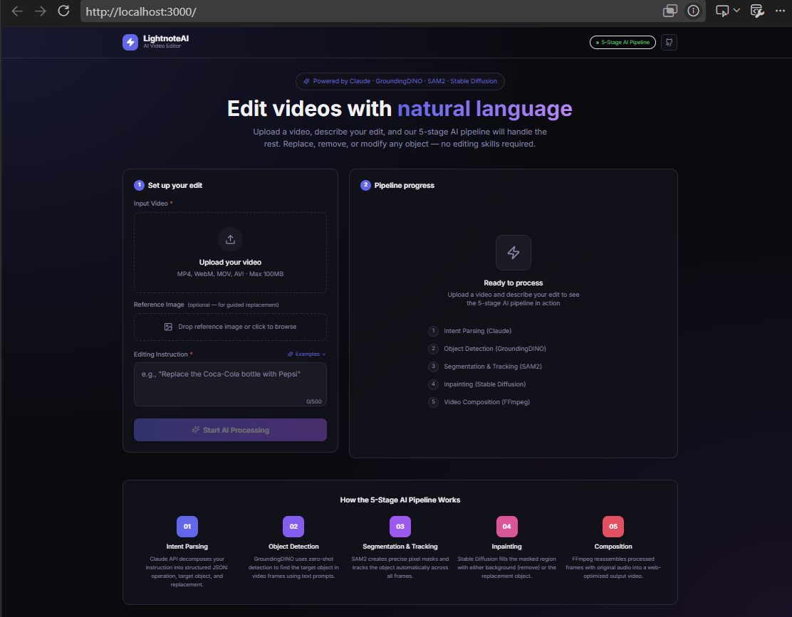</td>
<td>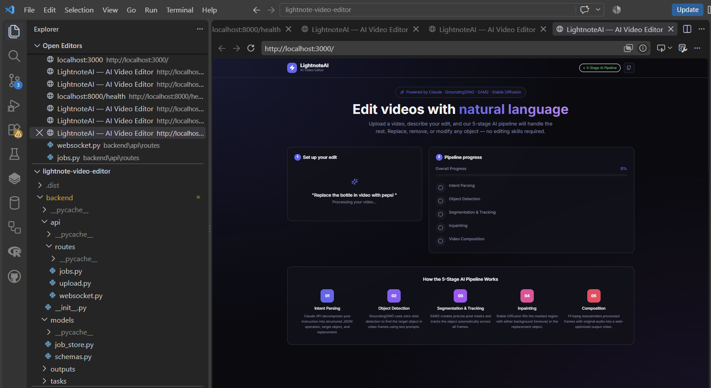</td>
<td>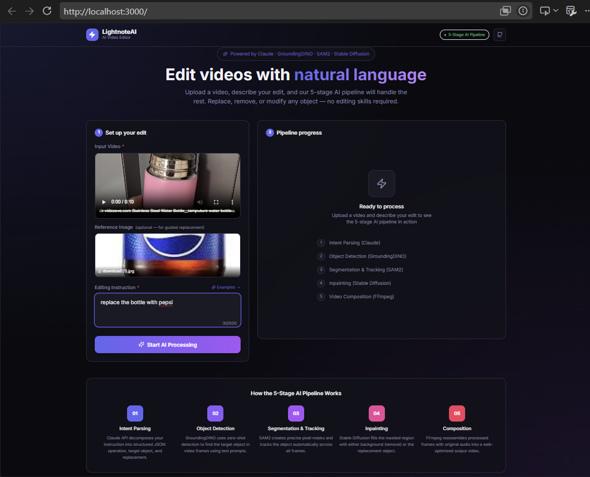</td>
</tr>
</table>

---


## Technical Design

The complete technical design is shown below in the same visual layout as the project design document. This keeps the architecture diagrams, tables, spacing, and overall presentation consistent on GitHub.

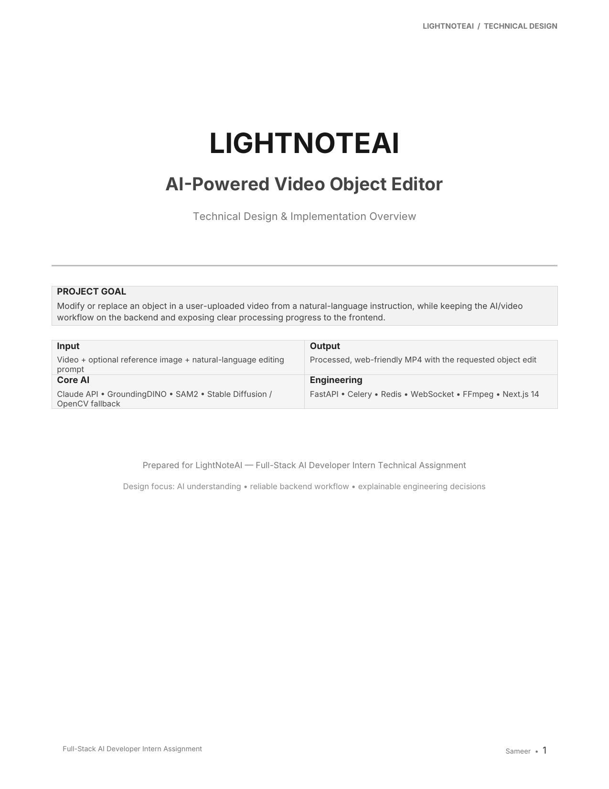

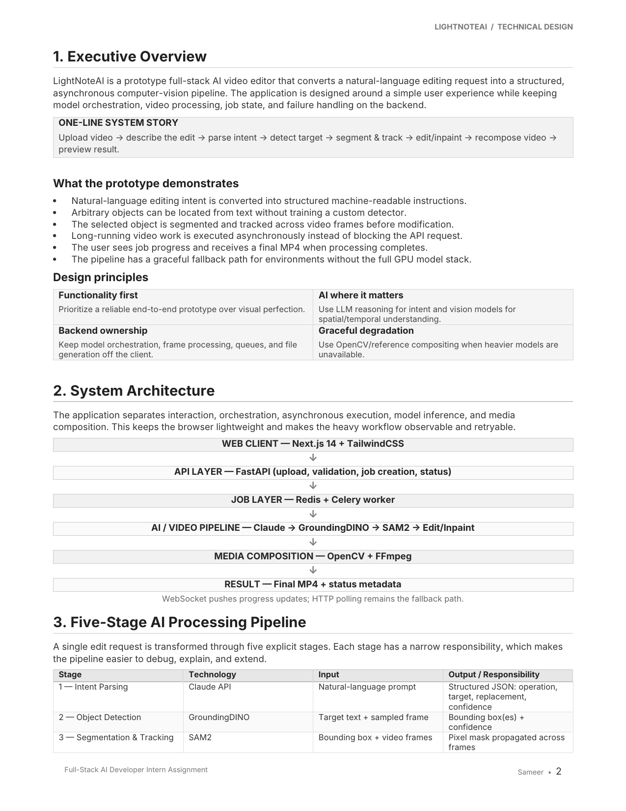

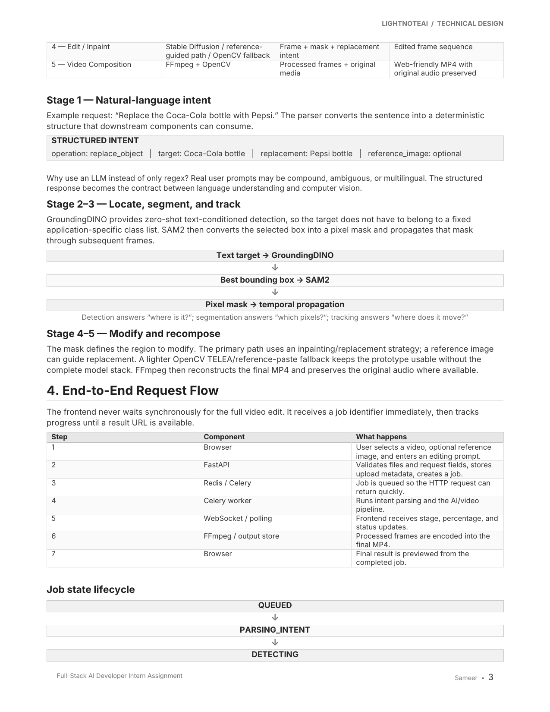

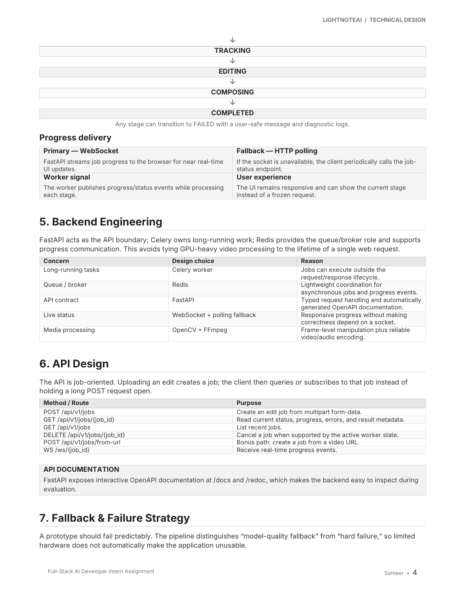

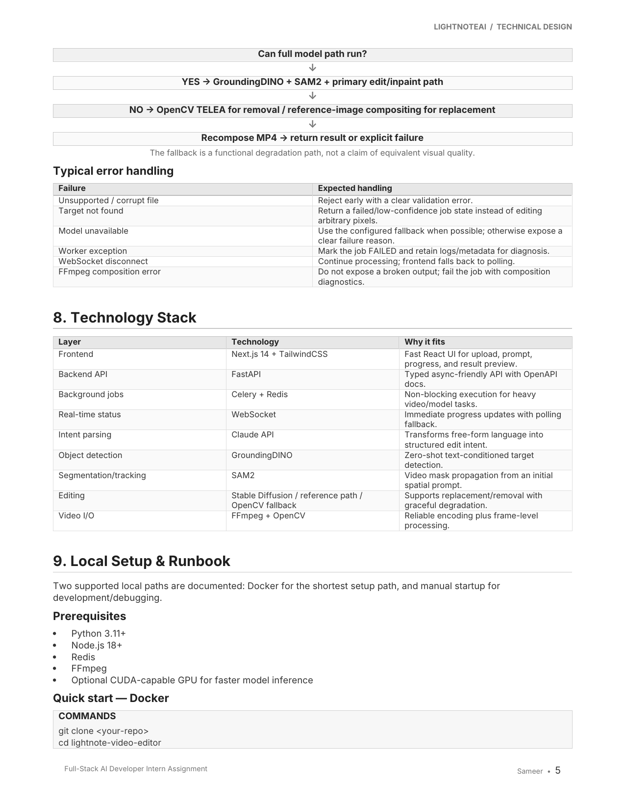

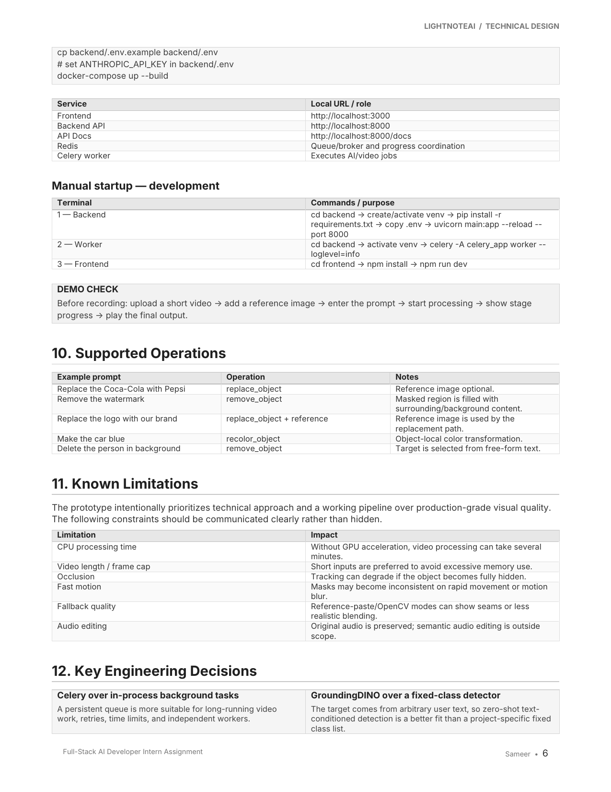

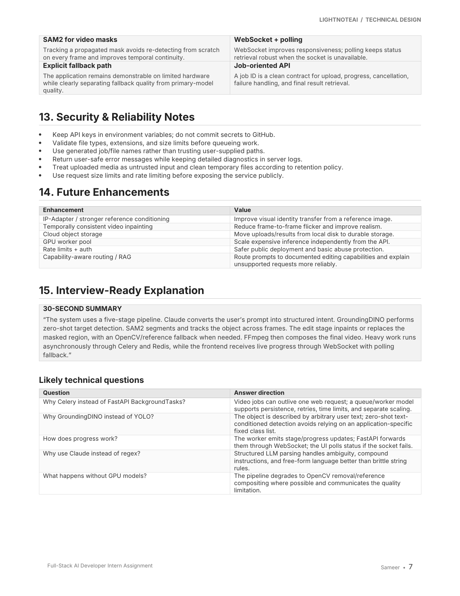

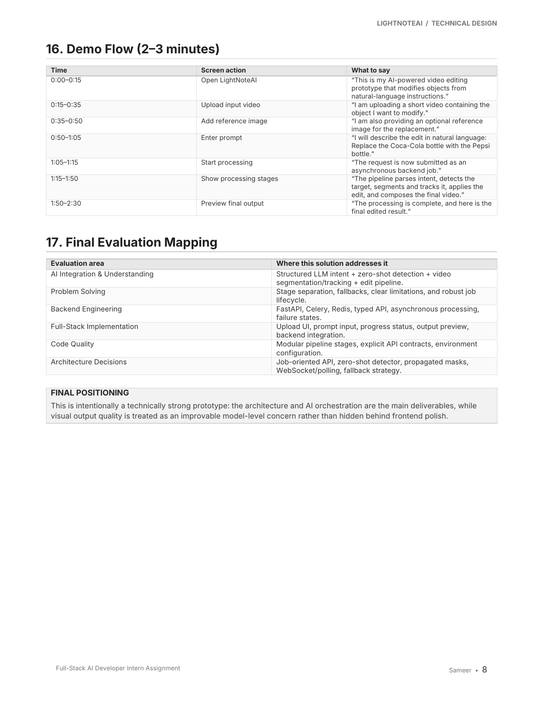

---

## Project Repository

The complete source code, setup instructions, environment configuration, and implementation are available in this repository.

### Repository Structure for the README

```text
README.md
|
+-- docs/
    +-- screenshots/
    |   +-- app-1.png
    |   +-- app-2.png
    |   +-- app-3.png
    |
    +-- word-pages/
        +-- page-1.png
        +-- page-2.png
        +-- page-3.png
        +-- page-4.png
        +-- page-5.png
        +-- page-6.png
        +-- page-7.png
        +-- page-8.png
```

**Important:** Keep the `docs/screenshots/` and `docs/word-pages/` folders with the README when pushing to GitHub. Do not rename or delete the image files.
